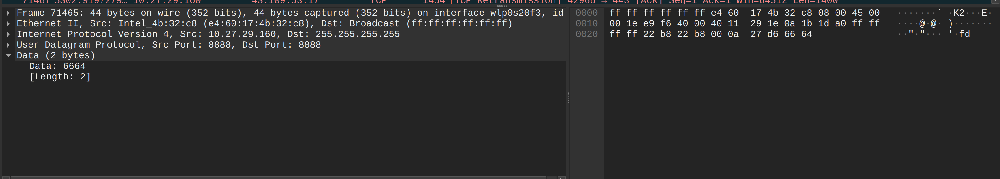

Вводим интерфейс из ip a:
```
andrey@Ubuntu-Andrey:~$ ip a
1: lo: <LOOPBACK,UP,LOWER_UP> mtu 65536 qdisc noqueue state UNKNOWN group default qlen 1000
    link/loopback 00:00:00:00:00:00 brd 00:00:00:00:00:00
    inet 127.0.0.1/8 scope host lo
       valid_lft forever preferred_lft forever
    inet6 ::1/128 scope host noprefixroute 
       valid_lft forever preferred_lft forever
2: wlp0s20f3: <BROADCAST,MULTICAST,UP,LOWER_UP> mtu 1500 qdisc noqueue state UP group default qlen 1000
    link/ether e4:60:17:4b:32:c8 brd ff:ff:ff:ff:ff:ff
    inet 10.27.29.160/24 brd 10.27.29.255 scope global dynamic noprefixroute wlp0s20f3
       valid_lft 3458sec preferred_lft 3458sec
    inet6 2a00:1fa2:c20d:2ef6:3449:9894:c7b5:5e7e/64 scope global temporary dynamic 
       valid_lft 7061sec preferred_lft 7061sec
    inet6 2a00:1fa2:c20d:2ef6:c0a6:f2c5:25fb:26a6/64 scope global dynamic mngtmpaddr noprefixroute 
       valid_lft 7061sec preferred_lft 7061sec
    inet6 fe80::6171:b5b9:8c05:dea1/64 scope link noprefixroute 
       valid_lft forever preferred_lft forever
3: virbr0: <NO-CARRIER,BROADCAST,MULTICAST,UP> mtu 1500 qdisc noqueue state DOWN group default qlen 1000
    link/ether 52:54:00:9c:32:31 brd ff:ff:ff:ff:ff:ff
    inet 192.168.122.1/24 brd 192.168.122.255 scope global virbr0
       valid_lft forever preferred_lft forever
4: docker0: <NO-CARRIER,BROADCAST,MULTICAST,UP> mtu 1500 qdisc noqueue state DOWN group default 
    link/ether b2:9c:69:c0:72:4b brd ff:ff:ff:ff:ff:ff
    inet 172.17.0.1/16 brd 172.17.255.255 scope global docker0
       valid_lft forever preferred_lft forever

```
Я выбирал wlp0s20f3

Переписывался с другим компьютером в локальной сети

Использовал программу из 6 задания, работает она корректно для этого задания

Пример работы программы:


```
andrey@Ubuntu-Andrey:~
/Programming/Элтекс/Модуль 3/Eltex_modul_3/08$ sudo ./udp_sniffer 
[sudo] пароль для andrey: 
====================================
UDP Sniffer - Захват UDP пакетов
====================================
Программа использует RAW сокеты
Требуются права root (запускайте с sudo)

Введите имя сетевого интерфейса (например, eth0, wlan0, lo): wlp0s20f3
Сокет успешно создан на интерфейсе wlp0s20f3
Выберите фильтр для захвата:
1. Чат (порт 8888) - обязательный фильтр
2. DNS (порт 53)
3. HTTP (порт 80)
4. Все UDP пакеты
Ваш выбор: 1
Выбран фильтр: ЧАТ (порт 8888)
Сохранить результаты в файл? (y/n): n

Начинаю захват пакетов...
Нажмите Ctrl+C для остановки
====================================

[3991.000383 ms] MAC: E4:60:17:4B:32:C8 -> FF:FF:FF:FF:FF:FF
      IP: 10.27.29.160 -> 255.255.255.255
      UDP: 8888 -> 8888
      Data: fd
      ---

```


# Программа из 6 задания
```
andrey@Ubuntu-Andrey:~/Programming/Элтекс/Модуль 3/Elte
x_modul_3/06$ ./main
Чат запущен. Введите сообщения (Ctrl+C для выхода):
[10.27.29.160] НОВЫЙ УЧАСТНИК ВОШЕЛ В ЧАТ
> 
[10.27.29.160] fd
> 
```




# Принятие DNS пакетов тоже работает

```
andrey@Ubuntu-Andrey:~/Programming/Элтекс/Модуль 3/Eltex_mo
dul_3/08$ sudo ./udp_sniffer 
====================================
UDP Sniffer - Захват UDP пакетов
====================================
Программа использует RAW сокеты
Требуются права root (запускайте с sudo)

Введите имя сетевого интерфейса (например, eth0, wlan0, lo): wlp0s20f3
Сокет успешно создан на интерфейсе wlp0s20f3
Выберите фильтр для захвата:
1. Чат (порт 8888) - обязательный фильтр
2. DNS (порт 53)
3. HTTP (порт 80)
4. Все UDP пакеты
Ваш выбор: 2
Выбран фильтр: DNS (порт 53)
Сохранить результаты в файл? (y/n): y
Введите имя файла (по умолчанию output.txt): 
Результаты сохраняются в файл: output.txt

Начинаю захват пакетов...
Нажмите Ctrl+C для остановки
====================================

[19719.000330 ms] MAC: E4:60:17:4B:32:C8 -> 92:38:25:E8:0A:C5
      IP: 10.27.29.160 -> 10.27.29.214
      UDP: 55940 -> 53
      Data: UY...........clients4.google.com..A..
      ---

[19720.000132 ms] MAC: E4:60:17:4B:32:C8 -> 92:38:25:E8:0A:C5
      IP: 10.27.29.160 -> 10.27.29.214
      UDP: 41782 -> 53
      Data: .............clients4.google.com.....
      ---

[19720.000238 ms] MAC: E4:60:17:4B:32:C8 -> 92:38:25:E8:0A:C5
      IP: 10.27.29.160 -> 10.27.29.214
      UDP: 39570 -> 53
      Data: .s...........clients4.google.com.....
      ---

[19724.000714 ms] MAC: 92:38:25:E8:0A:C5 -> E4:60:17:4B:32:C8
      IP: 10.27.29.214 -> 10.27.29.160
      UDP: 53 -> 41782
      Data: .............clients4.google.com..............D...clients.l.google.com..1.......p..*..P@..........f.... (ещё 83 байт)
      ---

[19759.000590 ms] MAC: 92:38:25:E8:0A:C5 -> E4:60:17:4B:32:C8
      IP: 10.27.29.214 -> 10.27.29.160
      UDP: 53 -> 55940
      Data: UY...........clients4.google.com..A...............clients.l...9.......V.&.ns1...dns-admin..:........... (ещё 11 байт)
      ---

[19760.000506 ms] MAC: E4:60:17:4B:32:C8 -> 92:38:25:E8:0A:C5
      IP: 10.27.29.160 -> 10.27.29.214
      UDP: 53231 -> 53
      Data: .............clients.l.google.com..A..
      ---

[19776.000154 ms] MAC: 92:38:25:E8:0A:C5 -> E4:60:17:4B:32:C8
      IP: 10.27.29.214 -> 10.27.29.160
      UDP: 53 -> 39570
      Data: .s...........clients4.google.com.............."...clients.l...1.......5.....n
      ---

[19788.000343 ms] MAC: 92:38:25:E8:0A:C5 -> E4:60:17:4B:32:C8
      IP: 10.27.29.214 -> 10.27.29.160
      UDP: 53 -> 53231
      Data: .............clients.l.google.com..A...........P.&.ns1...dns-admin..:..................<
      ---

[25961.000960 ms] MAC: E4:60:17:4B:32:C8 -> 92:38:25:E8:0A:C5
      IP: 10.27.29.160 -> 10.27.29.214
      UDP: 56127 -> 53
      Data: 4A...........glb-db52c2cf8be544.github.com.....
      ---

[25967.000286 ms] MAC: 92:38:25:E8:0A:C5 -> E4:60:17:4B:32:C8
      IP: 10.27.29.214 -> 10.27.29.160
      UDP: 53 -> 56127
      Data: 4A...........glb-db52c2cf8be544.github.com.....
      ---

[62740.000736 ms] MAC: E4:60:17:4B:32:C8 -> 92:38:25:E8:0A:C5
      IP: 10.27.29.160 -> 10.27.29.214
      UDP: 49838 -> 53
      Data: .S...........fd-api.cleantalk.org..A..
      ---

[62741.000252 ms] MAC: E4:60:17:4B:32:C8 -> 92:38:25:E8:0A:C5
      IP: 10.27.29.160 -> 10.27.29.214
      UDP: 43298 -> 53
      Data: .............fd-api.cleantalk.org.....
      ---

[62741.000420 ms] MAC: E4:60:17:4B:32:C8 -> 92:38:25:E8:0A:C5
      IP: 10.27.29.160 -> 10.27.29.214
      UDP: 51291 -> 53
      Data: .............fd-api.cleantalk.org.....
      ---

[62748.000896 ms] MAC: 92:38:25:E8:0A:C5 -> E4:60:17:4B:32:C8
      IP: 10.27.29.214 -> 10.27.29.160
      UDP: 53 -> 43298
      Data: .............fd-api.cleantalk.org..............,..*.....|).................,..*......h........
      ---

[62771.000329 ms] MAC: 92:38:25:E8:0A:C5 -> E4:60:17:4B:32:C8
      IP: 10.27.29.214 -> 10.27.29.160
      UDP: 53 -> 49838
      Data: .S...........fd-api.cleantalk.org..A.............E.ns-402.awsdns-50.com..awsdns-hostmaster.amazon.C.... (ещё 19 байт)
      ---

[62837.000388 ms] MAC: 92:38:25:E8:0A:C5 -> E4:60:17:4B:32:C8
      IP: 10.27.29.214 -> 10.27.29.160
      UDP: 53 -> 51291
      Data: .............fd-api.cleantalk.org..............X.....g.........X..A.n.
      ---
^C

Захват остановлен. Сохранение данных...

====================================
Захват завершен. Всего пакетов: 16
Результаты сохранены в файл.
Программа завершена.

```

Пакеты с wireshark в этом режиме тоже совпадают, но их поступает огромное количество
